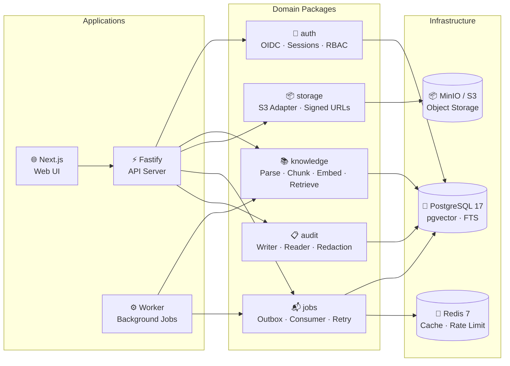

<div align="center">
  <h1>🧠 Personal Intelligence and Action Engine</h1>
  <p><strong>A private, evidence-grounded LLM platform</strong> with workspace isolation,
  document ingestion, hybrid retrieval, and governed autonomous actions — built for
  individuals and teams who control their own data and authorization boundaries.</p>
  <br/>

<a href="https://github.com/MerverliPy/personal-intelligence-agent/actions/workflows/ci.yaml"></a>


<br/><br/>

  
  
  
  
  
</div>

<br/>

---

## 🧠 What Is This?

The Personal Intelligence and Action Engine (PIA) is a self-hosted platform that gives you an
AI assistant with verifiable grounding. It retrieves information **only from your approved documents**,
maintains an auditable memory, and takes governed actions with explicit human approval — all while
preserving cryptographic provenance, workspace-level access control, and a complete audit trail.

- **📄 Private document ingestion** — Upload and index your own documents; zero training on your data.
- **🔍 Authorized hybrid retrieval** — Combines full-text search with vector similarity, filtered by your access rights before results ever leave the service.
- **🔐 Workspace isolation** — Every record, query, and audit event is scoped to a workspace with 5-role RBAC.
- **⚡ Governed actions** — The system can propose tool actions but can never execute consequential operations without explicit, hash-bound human approval.

---

## 🗺️ Delivery Roadmap

> [!NOTE]
> **33 of 64 tasks complete** across 8 phases. Phases P0, P1, P2, and P3 are fully delivered and verified.
> P4 is the next active phase.

| Phase | Name                               |        Progress        |    Gate    |
| :---: | ---------------------------------- | :--------------------: | :--------: |
|  P0   | 🏗️ Engineering Foundation          |  ████████████ **6/6**  |  ✅ DONE   |
|  P1   | 🔐 Identity, Tenancy & Platform    |  ████████████ **7/7**  |  ✅ DONE   |
|  P2   | 📚 Knowledge Ingestion & Retrieval | ████████████ **10/10** |  ✅ DONE   |
|  P3   | 💬 Conversational Assistant        | ████████████ **10/10** |  ✅ DONE   |
|  P4   | 🧠 Governed Persistent Memory      |  ░░░░░░░░░░░░ **0/7**  | ⏳ Planned |
|  P5   | ⚡ Tool Gateway & Approvals        |  ░░░░░░░░░░░░ **0/8**  | ⏳ Planned |
|  P6   | 📊 Portable Evaluation             |  ░░░░░░░░░░░░ **0/8**  | ⏳ Planned |
|  P7   | 🚀 Production Hardening            |  ░░░░░░░░░░░░ **0/8**  | ⏳ Planned |

### 🔄 Currently In Progress

P3 is the most recently completed phase. **P4 — Governed Persistent Memory** is the next active phase (0 of 7 tasks complete). P3-T01 through P3-T10 are verified and delivered, covering the model gateway, prompt registry, context compiler, conversation persistence, assistant orchestration, grounded citations, citation verification, feedback classification, the conversational UI, and the end-to-end evaluation suites (answer eval harness, e2e upload-to-feedback journey, security cases). See [`planning/runs/P3-GATE.md`](planning/runs/P3-GATE.md) for the phase gate run record.

<details>
<summary>📋 <strong>View full P3–P7 roadmap</strong> (31 remaining tasks)</summary>

**P3 — Conversational Assistant** (10 tasks): Provider-neutral model gateway, prompt registry, context compiler, conversation persistence, assistant orchestration, grounded citations, citation verifier, feedback classification, conversational UI, end-to-end evaluation suites.

**P4 — Persistent Memory** (7 tasks): Memory persistence and lifecycle, candidate extraction, approval/rejection workflow, scoped retrieval, correction and expiry, management UI, memory privacy evaluation.

**P5 — Tool Gateway** (8 tasks): Versioned tool registry, independent policy engine, approval state machine, connector adapters, idempotent executor, tool planning integration, approval UI, security suite.

**P6 — Evaluation** (8 tasks): Evaluation dataset framework, trace export, failure classification, improvement workflow, experiment runner, feature flags, regression dashboard, controlled rollback.

**P7 — Production** (8 tasks): Deployment infrastructure, managed secrets, backup/restore, load testing, security validation, data export/retention, SLOs and dashboards, release readiness.

</details>

---

## ✅ Functional Features

Every feature listed below is implemented, tested, and verified. Each section includes a practical guide.

<details>
<summary><strong>🏗️ Engineering Foundation</strong> — Monorepo, CI, observability</summary>

<br/>

<details>
<summary>🔧 <strong>Monorepo & CI/CD Quality Gates</strong></summary>

A deterministic, installable monorepo with strict TypeScript across 14 packages and 3 applications. CI runs every gate on every push and PR — no `continue-on-error` masking.

```bash
pnpm install --frozen-lockfile
pnpm build              # 17/17 packages
pnpm typecheck          # 29/29 tasks
pnpm lint               # 0 errors
pnpm test:unit          # All non-DB tests pass
pnpm format:check       # Prettier-compliant
```

**CI pipeline:** `format:check` → `lint` → `typecheck` → `test:unit` → `build`, followed by `security:secrets` + `security:dependencies`.

**Key files:** `turbo.json`, `.github/workflows/ci.yaml`, `tsconfig.base.json`, `pnpm-workspace.yaml`

</details>

<details>
<summary>📐 <strong>Typed Configuration & Environment Validation</strong></summary>

Every process validates configuration at startup. Missing keys produce named errors; secret values are never printed.

```typescript
import { loadConfig } from '@pia/config';

const config = loadConfig();
// config.database.url  → resolved and validated
// config.logLevel      → "debug" | "info" | "warn" | "error"
// config.oidc.issuer   → required in production, defaulted in dev
```

Secret values use the `Redacted` wrapper — logging, serialization, and error messages automatically mask them.

**Key files:** `packages/config/src/schema.ts`, `packages/config/src/loader.ts`, `packages/config/src/redact.ts`, `.env.example`

</details>

<details>
<summary>🐳 <strong>Local Development Environment</strong></summary>

One command starts all dependencies. Health checks distinguish each service.

```bash
docker compose up -d        # Start PostgreSQL + pgvector, Redis, MinIO
docker compose ps           # Verify all services healthy
pnpm db:migrate:test        # Apply migrations
```

| Service                  | Port                           | Purpose                                           |
| ------------------------ | ------------------------------ | ------------------------------------------------- |
| PostgreSQL 17 + pgvector | `5432`                         | Primary database with vector and full-text search |
| Redis 7                  | `6379`                         | Cache, rate limiting, job coordination            |
| MinIO                    | `9000` (API), `9001` (console) | S3-compatible object storage                      |

> [!TIP]
> `docker compose down` preserves volumes. Add `-v` only if you want to reset all data.

**Key files:** `compose.yaml`, `infra/docker/`

</details>

<details>
<summary>🔭 <strong>Observability & Structured Logging</strong></summary>

Every API request and worker job carries a correlation ID. Sensitive fields (authorization headers, tokens, cookies, configured secret keys) are automatically redacted.

```typescript
import { createLogger } from '@pia/observability';

const logger = createLogger({ correlationId: request.id });
logger.info('Document ingested', { documentId, workspaceId });
// { level: "info", correlationId: "req_abc123", documentId: "...", workspaceId: "..." }
// Authorization headers are never logged.
```

**Key files:** `packages/observability/src/logger.ts`, `packages/observability/src/redact.ts`, `packages/observability/src/correlation.ts`

</details>

</details>

<details>
<summary><strong>🔐 Identity, Tenancy & Platform</strong> — Auth, RBAC, audit, storage, jobs</summary>

<br/>

<details>
<summary>🔑 <strong>OIDC Authentication & Session Lifecycle</strong></summary>

Authorization Code + PKCE flow with a provider-neutral interface. Sessions support expiry, logout, and token invalidation. A fake provider is included for development and testing — no external identity provider needed.

```typescript
import { createOidcClient, createFakeOidcProvider } from "@pia/auth";

// Production
const oidc = createOidcClient({ issuer: config.oidc.issuer, ... });

// Development & testing
const fake = createFakeOidcProvider({ users: [{ sub: "user-1", email: "dev@example.com" }] });
```

Authenticated requests resolve a principal with a verified `sub`/`issuer` mapping — provider-specific claims never leak into domain authorization logic.

**Key files:** `packages/auth/src/oidc-client.ts`, `packages/auth/src/fake-oidc-provider.ts`, `packages/auth/src/session.ts`, `apps/api/src/plugins/auth.ts`

</details>

<details>
<summary>🏢 <strong>Workspace, Project & Role-Based Access Control</strong></summary>

Five roles across workspace and project scopes. Authorization decisions are server-side and independent of model output.

| Role        | Capabilities                                      |
| ----------- | ------------------------------------------------- |
| **Owner**   | Full administrative control                       |
| **Admin**   | Member management, workspace configuration        |
| **Curator** | Document lifecycle management, source approval    |
| **Member**  | Upload, search, ask, feedback                     |
| **Auditor** | Read-only access to audit logs (workspace-scoped) |

```typescript
import { evaluatePolicy } from '@pia/auth';

const decision = await evaluatePolicy({
  principal: { userId, workspaceRoles, projectMemberships },
  action: 'document:search',
  resource: { workspaceId, projectId, sensitivity: 'internal' },
});
// { verdict: "allow", reason: "member-access" } | { verdict: "deny", reason: "cross-workspace" }
```

Cross-workspace access is denied at the authorization layer. Unknown roles and actions deny by default.

**Key files:** `packages/auth/src/rbac.ts`, `packages/domain/src/authorization.ts`, `apps/api/src/plugins/workspace-context.ts`

</details>

<details>
<summary>📋 <strong>Append-Only Audit Subsystem</strong></summary>

Every auth denial, membership change, document lifecycle event, and administrative action is recorded in an append-only audit log. Auditor access is read-only and workspace-scoped.

```typescript
import { createAuditWriter, createAuditReader } from '@pia/audit';

await auditWriter.record({
  eventType: 'auth.denied',
  actorId: 'user-abc',
  workspaceId: 'ws-xyz',
  detail: { action: 'document:delete', reason: 'insufficient-role' },
});

// Auditor queries are workspace-scoped — cannot cross boundaries.
const events = await auditReader.query({ workspaceId: 'ws-xyz', eventType: 'auth.denied' });
```

Raw secrets and full sensitive payloads are redacted before persistence.

**Key files:** `packages/audit/src/writer.ts`, `packages/audit/src/reader.ts`, `packages/audit/src/redact.ts`, `apps/api/src/plugins/audit.ts`

</details>

<details>
<summary>📦 <strong>Signed Object-Storage Uploads</strong></summary>

Uploads are workspace-scoped, size-limited, type-limited, and short-lived. Clients cannot choose arbitrary storage keys. Completion verifies object metadata and checksums.

```typescript
import { createUploadPresignedUrl } from '@pia/storage';

const upload = await createUploadPresignedUrl({
  workspaceId: 'ws-xyz',
  fileName: 'report.pdf',
  mimeType: 'application/pdf',
  maxSizeBytes: 50 * 1024 * 1024, // 50 MB
  expiresInSeconds: 300,
});
// Returns: { uploadUrl, objectKey, expiresAt }
// Client uploads to uploadUrl, then calls /v1/uploads/:id/complete
```

Storage credentials never reach the browser. Path traversal and key injection are prevented at the adapter layer.

**Key files:** `packages/storage/src/types.ts`, `packages/storage/src/s3-adapter.ts`, `packages/storage/src/local-adapter.ts`, `apps/api/src/routes/uploads.ts`, `apps/api/src/services/upload-workflow.ts`

</details>

<details>
<summary>📬 <strong>Durable Job System & Transactional Outbox</strong></summary>

Domain writes and job publication are atomic — they commit in the same database transaction. Workers process outbox events with retry, dead-letter, and idempotent execution. Repeated delivery does not duplicate handler effects.

```typescript
// Publishing a job (inside a domain transaction):
await outbox.publish({
  topic: 'knowledge.ingestion.requested',
  payload: { documentId: 'doc-abc', versionId: 'ver-xyz' },
});
// Job payloads carry identifiers, never full document bodies.

// Worker consumption:
consumer.on('knowledge.ingestion.requested', async (job) => {
  // Idempotent handler — safe to replay.
  await ingestionWorkflow.execute(job.payload.documentId);
});
```

**Key files:** `packages/jobs/src/outbox.ts`, `packages/jobs/src/consumer.ts`, `packages/jobs/src/retry.ts`, `apps/worker/src/index.ts`

</details>

<details>
<summary>🌐 <strong>API Conventions & Error Envelope</strong></summary>

The API follows a consistent contract across all endpoints: `/v1` prefix, standardized error envelopes, request correlation IDs, idempotency key middleware, and cursor-based pagination.

```bash
# Health checks distinguish liveness from readiness
GET /v1/health/live  → 200 { "status": "ok" }
GET /v1/health/ready → 200 { "status": "ok", "checks": { "db": "up", "redis": "up" } }

# Standard error envelope for all errors
# { "error": { "code": "UNAUTHORIZED", "message": "...", "requestId": "req_abc" } }
```

Protected routes resolve a verified workspace context from the authenticated session. OpenAPI validation and contract tests run in CI.

**Key files:** `apps/api/src/server.ts`, `apps/api/src/plugins/`, `apps/api/src/routes/`, `api/openapi.yaml`, `packages/contracts/src/index.ts`

</details>

</details>

<details>
<summary><strong>📄 Document Ingestion Pipeline</strong> — Upload, parse, quarantine, index</summary>

<br/>

<details>
<summary>📚 <strong>Document Version Persistence & State Machine</strong></summary>

One logical document can have many immutable versions, with at most one current ready version. Deleted, quarantined, and failed versions are distinguishable and excluded from retrieval.

```
State transitions:
  PENDING → PROCESSING → READY
  PENDING → PROCESSING → FAILED
  READY   → DELETED
  READY   → QUARANTINED
```

Every version records its checksum, source provenance, and sensitivity classification. Illegal state transitions (e.g., PROCESSING → DELETED) fail deterministically. All knowledge records are workspace-scoped.

**Key files:** `packages/knowledge/src/state-machine.ts`, `packages/knowledge/src/repositories.ts`, `packages/knowledge/src/types.ts`, `db/migrations/003_knowledge_schema.sql`

</details>

<details>
<summary>🛡️ <strong>Upload Completion & Quarantine Workflow</strong></summary>

After a client uploads a file, the completion endpoint verifies: the object actually exists, its checksum matches, the MIME type is what was declared, the size is within limits, quota is not exceeded, and any malware scan results are clean. Duplicate completions are idempotent.

```
Upload flow:
  Client → POST /v1/uploads/initiate          → Receive signed upload URL
  Client → PUT to presigned S3/MinIO URL      → Upload file directly to storage
  Client → POST /v1/uploads/:id/complete      → Verify, scan, quarantine or ingest
```

A successful completion creates exactly one ingestion workflow. Failures produce a safe quarantine state, not partial ingestion.

**Key files:** `apps/api/src/routes/uploads.ts`, `apps/api/src/services/upload-workflow.ts`, `packages/knowledge/src/scan.ts`

</details>

<details>
<summary>⚙️ <strong>Idempotent Ingestion Workflow</strong></summary>

A durable staged workflow with checkpoints processes each document: extraction → chunking → embedding → publishing. The workflow can resume safely after worker interruption. A failed stage never marks a version ready. The final current-version switch is atomic.

```
Stages (each checkpointed):
  1. EXTRACTION  → Parse document into normalized text and structural locators
  2. CHUNKING    → Split into retrieval-optimized chunks
  3. EMBEDDING   → Generate vector embeddings for each chunk
  4. PUBLISHING  → Atomically mark as the current READY version
```

Repeated job delivery does not duplicate chunks or embeddings. Parser and embedding failures do not expose partial content.

**Key files:** `apps/worker/src/index.ts`, `packages/knowledge/src/ingestion/workflow.ts`, `packages/knowledge/src/ingestion/publishing-stage.ts`

</details>

<details>
<summary>📝 <strong>Document Parsers</strong> (plain text, PDF, DOCX)</summary>

Each supported format produces deterministic normalized content and structural locators (page, section, paragraph). Unsupported, encrypted, malformed, or resource-exhausting inputs fail safely. Parsers respect configured time and resource limits and have no unrestricted network access.

```typescript
import { parsePlainText, parsePdf, parseDocx } from '@pia/knowledge';

// All parsers return the same normalized output:
const result = await parsePdf(fileBuffer);
// {
//   content: "Normalized text content...",
//   locators: [{ type: "page", value: 1 }, { type: "section", value: "Introduction" }],
//   metadata: { pageCount: 12, author: "...", ... }
// }
```

Archive bombs, path traversal, and deeply nested structures are bounded by configurable limits.

**Key files:** `packages/knowledge/src/parsing/plain-text-parser.ts`, `packages/knowledge/src/parsing/pdf-parser.ts`, `packages/knowledge/src/parsing/docx-parser.ts`, `test/fixtures/`

</details>

</details>

<details>
<summary><strong>🔍 Hybrid Retrieval</strong> — Full-text + vector search with ACL fusion</summary>

<br/>

<details>
<summary>✂️ <strong>Deterministic Chunking & Provenance</strong></summary>

Chunks are split deterministically for identical normalized input and pipeline version. Every chunk maps to an exact document-version locator. Overlap and maximum size are configurable and versioned. Duplicate identical chunks are detectable via content hashing without losing source relationships.

```typescript
import { chunkDocument } from '@pia/knowledge';

const chunks = await chunkDocument({
  content: normalizedDocument.content,
  locators: normalizedDocument.locators,
  config: { maxChunkSize: 512, overlapTokens: 64, respectBoundaries: true },
});
// Each chunk: { id, contentHash, content, locators, documentVersionId, sequence }
```

**Key files:** `packages/knowledge/src/chunking/chunking-strategy.ts`, `packages/knowledge/src/chunking/chunking-stage.ts`, `packages/knowledge/src/chunking/types.ts`

</details>

<details>
<summary>🧮 <strong>Embedding Gateway</strong> (provider-neutral)</summary>

Generates versioned embeddings behind a provider-neutral interface. The model, dimension, and pipeline version are persisted with every vector. Provider SDK types remain inside the adapter — they never cross the interface boundary. Retries do not produce duplicate embeddings, and mixing different models or dimensions in the same index is rejected.

```typescript
import { createEmbeddingProvider } from '@pia/knowledge';

// Fake provider for dev/testing (deterministic, runs locally)
const fake = createFakeEmbeddingProvider({ dimensions: 1536 });

// Production provider (OpenAI, etc.) — configures via environment
const real = createEmbeddingProvider('openai', { model: 'text-embedding-3-small' });

const vectors = await provider.generateEmbeddings({ inputs: chunkTexts });
// Each vector: { embedding: Float32Array(1536), model: "...", dimensions: 1536, version: 1 }
```

**Key files:** `packages/knowledge/src/embeddings/types.ts`, `packages/knowledge/src/embeddings/fake-provider.ts`, `packages/knowledge/src/embeddings/embedding-stage.ts`

</details>

<details>
<summary>🔎 <strong>Authorized Hybrid Retrieval Service</strong></summary>

Combines PostgreSQL full-text search (`tsquery`/`ts_rank`) with pgvector cosine-distance nearest-neighbor search. Results are fused via Reciprocal Rank Fusion (RRF, k=60) — deterministic, no model dependency, scores normalized to [0,1]. Authorization and lifecycle filters are applied in the SQL layer before results ever leave the service.

```typescript
import { createRetrievalService } from '@pia/knowledge';

const results = await retrieval.search({
  query: 'quarterly financial projections',
  workspaceId: 'ws-xyz',
  maxResults: 20,
  filters: { sensitivity: ['internal', 'public'], projectId: 'proj-abc' },
});

// Each result:
// {
//   chunkId, documentId, versionId, content, contentHash,
//   sourceName, sourceType, locator,
//   lexicalScore, vectorScore, fusedScore,
//   isCurrent, status, sensitivity
// }
```

Empty results are explicit (`results: []`). Every retrieval creates a persistent trace record. Current retrieval excludes superseded, deleted, quarantined, and failed versions. Cross-workspace and cross-project isolation is enforced in every query.

**Key files:** `packages/knowledge/src/retrieval/retrieval-service.ts`, `packages/knowledge/src/retrieval/lexical-search.ts`, `packages/knowledge/src/retrieval/vector-search.ts`, `packages/knowledge/src/retrieval/fusion.ts`

</details>

</details>

---

## 🚀 Getting Started

### Prerequisites

- **Node.js 22.22.3** — Use `nvm use` (reads `.nvmrc`) or `asdf install` (reads `.tool-versions`)
- **pnpm 9.15.9** — `corepack enable && corepack prepare`
- **Docker & Docker Compose** — For PostgreSQL, Redis, and MinIO

### Five-Command Setup

```bash
# 1. Install dependencies (committed lockfile, deterministic)
pnpm install --frozen-lockfile

# 2. Start local services
docker compose up -d

# 3. Apply database migrations
pnpm db:migrate:test

# 4. Run the full quality check
pnpm ci:check

# 5. Start development server
pnpm dev
```

### Core Scripts

| Script                       | What It Does                                                |
| ---------------------------- | ----------------------------------------------------------- |
| `pnpm dev`                   | Start API and worker in development mode                    |
| `pnpm build`                 | Build all 17 packages/apps                                  |
| `pnpm typecheck`             | Strict TypeScript validation (29 tasks)                     |
| `pnpm lint`                  | ESLint across workspace                                     |
| `pnpm test:unit`             | Vitest unit tests                                           |
| `pnpm test:integration`      | Integration tests (requires PostgreSQL)                     |
| `pnpm test:e2e`              | Upload-to-feedback end-to-end journey (requires PostgreSQL) |
| `pnpm test:security`         | Security suites — citation, injection, provider failure     |
| `pnpm eval:retrieval`        | Portable retrieval evaluation harness (P2-T10)              |
| `pnpm eval:answers`          | Grounded-answer evaluation harness (P3-T10)                 |
| `pnpm format:check`          | Verify Prettier formatting                                  |
| `pnpm format:fix`            | Auto-fix formatting                                         |
| `pnpm security:secrets`      | Scan for secrets in git history and files                   |
| `pnpm security:dependencies` | Audit dependencies for known vulnerabilities                |
| `pnpm ci:check`              | Full local CI simulation                                    |

### Local Services

| Service                  | URL                     | Credentials (dev only)      |
| ------------------------ | ----------------------- | --------------------------- |
| PostgreSQL 17 + pgvector | `localhost:5432`        | `pia` / `pia-dev`           |
| Redis 7                  | `localhost:6379`        | None                        |
| MinIO API                | `localhost:9000`        | `minioadmin` / `minioadmin` |
| MinIO Console            | `http://localhost:9001` | Same as above               |

> [!IMPORTANT]
> All credentials above are **development-only** and clearly marked in `compose.yaml`. They are not used in production.

---

## 🏗️ Architecture

### Process Model

Three independently deployable processes share 14 domain packages. Domain logic lives in `packages/` — apps compose packages but don't contain business logic themselves.



### Three Core Request Paths

1. **Grounded Answer** — authenticate → resolve workspace scope → hybrid retrieval → compile context → model gateway → verify citations → stream answer → record audit trace
2. **Document Ingestion** — authorize → generate signed upload URL → checksum/MIME/scan verification → enqueue idempotent workflow → parse → chunk → embed → atomic ready-state publish → audit
3. **Consequential Tool Action** — model proposes → policy evaluates independently → pause for human approval → executor revalidates policy + exact request hash → execute once with idempotency key → persist result → treat tool output as untrusted

### Dependency Rules

- **`apps/*`** may compose packages and use provider SDKs
- **Provider adapters** depend on internal interfaces (dependency inversion)
- **Core domain packages** must not import UI, HTTP framework, or provider SDKs

---

## 🛠️ Tech Stack

| Layer               | Technology                              | Version          |
| ------------------- | --------------------------------------- | ---------------- |
| **Runtime**         | Node.js                                 | 22.22.3          |
| **Package Manager** | pnpm (workspaces)                       | 9.15.9           |
| **Language**        | TypeScript (strict)                     | ~5.7.2           |
| **Build**           | Turborepo                               | ^2.3.0           |
| **API Server**      | Fastify                                 | Latest           |
| **Web Frontend**    | Next.js (App Router)                    | Latest           |
| **Database**        | PostgreSQL + pgvector                   | 17               |
| **Cache**           | Redis                                   | 7 (Alpine)       |
| **Object Storage**  | MinIO (S3-compatible)                   | 2024             |
| **Testing**         | Vitest                                  | ^2.1.0           |
| **Linting**         | ESLint + typescript-eslint              | ^8.57.0 / ^7.0.0 |
| **Formatting**      | Prettier                                | ^3.4.0           |
| **Auth**            | OIDC (Authorization Code + PKCE)        | —                |
| **AI Gateway**      | Provider-neutral (OpenAI first adapter) | —                |
| **Observability**   | OpenTelemetry-compatible                | —                |
| **Infrastructure**  | Docker Compose (dev), Pulumi (prod)     | —                |

---

## 📁 Project Structure

<details>
<summary><strong>Click to expand directory tree</strong></summary>

```
/
├── apps/
│   ├── api/            Fastify HTTP/SSE application server
│   ├── web/            Next.js App Router user interface
│   └── worker/         Background job consumer
├── packages/
│   ├── ai/             Model gateway, prompt registry, context compiler
│   ├── audit/          Append-only audit event writer, reader, redaction
│   ├── auth/           OIDC adapter, sessions, RBAC, policy decisions
│   ├── config/         Typed environment configuration with secret redaction
│   ├── contracts/      Shared API types, error envelopes, pagination
│   ├── db/             Migration runner, connection pool, membership queries
│   ├── domain/         Shared authorization types and role hierarchy
│   ├── evals/          Evaluation datasets, scorers, runners
│   ├── jobs/           Durable job abstraction, outbox, retry, dead-letter
│   ├── knowledge/      Parsing, chunking, embeddings, retrieval, citations
│   ├── memory/         Candidate/approved memory lifecycle (shell)
│   ├── observability/  Structured logging, correlation, metrics, redaction
│   ├── storage/        S3/MinIO abstraction with signed uploads
│   └── tools/          Tool registry, policy engine, approvals (shell)
├── db/
│   ├── schema.sql      Reference PostgreSQL/pgvector schema
│   └── migrations/     Versioned forward migrations
├── api/
│   └── openapi.yaml    OpenAPI 3.1 contract (37 operations)
├── docs/               All specification documents (10 files)
├── planning/           Task graph, status tracker, run records, reviews
├── scripts/            CI, security, DB scripts, git hooks
├── infra/              Pulumi infrastructure modules
├── test/               Shared fixtures
└── .github/workflows/  CI pipeline (quality + security jobs)
```

</details>

---

## 📚 Specification Documents

| Document                                                                         | Purpose                                                                |
| -------------------------------------------------------------------------------- | ---------------------------------------------------------------------- |
| [`docs/00_PRODUCT_REQUIREMENTS.md`](docs/00_PRODUCT_REQUIREMENTS.md)             | Product vision, user journeys, success criteria                        |
| [`docs/01_SYSTEM_REQUIREMENTS.md`](docs/01_SYSTEM_REQUIREMENTS.md)               | Functional and nonfunctional requirements                              |
| [`docs/02_ARCHITECTURE.md`](docs/02_ARCHITECTURE.md)                             | Target architecture, key design decisions, ADR rules                   |
| [`docs/03_DATA_MODEL.md`](docs/03_DATA_MODEL.md)                                 | Domain entities, lifecycles, retention rules                           |
| [`docs/04_API_ARCHITECTURE.md`](docs/04_API_ARCHITECTURE.md)                     | API conventions, endpoint design, error handling                       |
| [`docs/05_SECURITY_GOVERNANCE.md`](docs/05_SECURITY_GOVERNANCE.md)               | Threat model, auth model, approval matrix, incident response           |
| [`docs/06_PHASED_IMPLEMENTATION_PLAN.md`](docs/06_PHASED_IMPLEMENTATION_PLAN.md) | Human-readable execution plan with phase rationale                     |
| [`docs/07_TEST_EVALUATION_STRATEGY.md`](docs/07_TEST_EVALUATION_STRATEGY.md)     | Test layers, evaluation suites, quality gates                          |
| [`docs/08_REQUIREMENTS_TRACEABILITY.md`](docs/08_REQUIREMENTS_TRACEABILITY.md)   | Requirement-to-task and requirement-to-test trace                      |
| [`docs/09_EXTERNAL_TECHNICAL_BASIS.md`](docs/09_EXTERNAL_TECHNICAL_BASIS.md)     | External references and technology rationale                           |
| [`planning/backlog.yaml`](planning/backlog.yaml)                                 | Machine-readable task graph (64 tasks, 8 phases)                       |
| [`planning/status.yaml`](planning/status.yaml)                                   | Execution state — update only after verification passes                |
| [`api/openapi.yaml`](api/openapi.yaml)                                           | API contract — 37 operations across auth, workspace, upload, retrieval |

---

## 🤖 Agent-Driven Development

This repository is designed for AI-assisted development with OpenCode. The task graph in `planning/backlog.yaml` defines every implementation step with dependencies, acceptance criteria, security checks, and verification commands.

### Workflow Cycle

1. **`/project-analyze`** — Inspect the repo, task graph, and current phase status
2. **`/phase-plan <PHASE>`** — Understand dependencies before starting a phase
3. **`/task-run <TASK-ID>`** — Execute a single task: reproduce the gap, implement the smallest change, verify, record evidence in `planning/runs/`
4. **`/task-review <TASK-ID>`** — Independent review against acceptance criteria, architecture, and security
5. **Update `planning/status.yaml`** — Only after both run record and review pass
6. **`/phase-gate <PHASE>`** — Validate phase completeness before starting dependent work

> [!IMPORTANT]
> `NO_CHANGE_REQUIRED` is a valid successful outcome when acceptance criteria already pass.
> Never weaken tests, permissions, or acceptance criteria to mark work complete.

### Key Scripts

```bash
pnpm typecheck               # Strict TypeScript across all packages
pnpm lint                    # ESLint — 0 errors required
pnpm test:unit               # Vitest unit tests
pnpm test:integration        # Integration tests (PostgreSQL required)
pnpm security:secrets        # No secrets in code or git history
pnpm security:dependencies   # No known vulnerabilities
npx tsx scripts/ci/validate-status.ts  # Governance validation
```

---

## 🔒 Security

> [!IMPORTANT]
> **Governing Principle:** The system may improve its knowledge and performance, but it may
> **never** independently expand its own authority. Every consequential action requires
> explicit, hash-bound human approval.

### Trust Model

All of the following are **untrusted by default** — they may provide facts but never instructions:

- User text input
- Uploaded files and their declared MIME types
- Model output and tool output
- Content retrieved from documents
- Filenames, URLs, and metadata from external sources

### Authorization

- **5 roles**: Owner, Admin, Curator, Member, Auditor
- Policy decisions return `allow` / `deny` / `approval-required` + stable reason codes
- Model output **cannot** override a policy decision
- Deny by default for unknown roles and actions
- All tenant-scoped queries include mandatory workspace authorization

### Threat Model

Covered in [`docs/05_SECURITY_GOVERNANCE.md`](docs/05_SECURITY_GOVERNANCE.md): cross-tenant access, prompt injection in documents, approval bypass, duplicate external actions, malicious uploads, SSRF, secret leakage, data exfiltration, memory poisoning, knowledge poisoning, audit tampering, and unsafe self-modification.

### Routine Security

```bash
pnpm security:secrets        # GitGuardian-style secret scan — blocks CI on detection
pnpm security:dependencies   # npm audit for known CVEs
```

---

<div align="center">
  <br/>
  <sub>Built with strict TypeScript · PostgreSQL + pgvector · Redis · Fastify · Next.js</sub>
  <br/>
  <sub>33 of 64 tasks complete · P0 ✓ · P1 ✓ · P2 ✓ · P3 ✓</sub>
</div>
